# Documentation technique

## Projet d'analyse de données hospitalières

---

**Auteurs** : Paul-Henri DOURNEAU & Dorian MARTY

**Date de création** : 09/01/2026

**Dernière mise à jour** : 20/02/2026

**Version** : 3.0

---

## Table des matières

1. [Introduction et contexte](#1-introduction-et-contexte)
2. [Architecture du projet](#2-architecture-du-projet)
3. [Les données](#3-les-données)
4. [Les modèles](#4-les-modèles)
5. [Guide d'utilisation](#5-guide-dutilisation)
6. [Conclusion et perspectives](#6-conclusion-et-perspectives)
7. [Annexes](#7-annexes)

---

## 1. Introduction et contexte

### 1.1 Problématique médicale

Dans le contexte hospitalier, deux enjeux majeurs se posent quotidiennement :

1. **La détection précoce des détériorations** : Comment identifier les patients dont l'état de santé risque de se dégrader rapidement (choc septique, arrêt cardiaque, détresse respiratoire) ?

2. **L'optimisation de la gestion des lits** : Comment anticiper la durée de séjour des patients pour mieux planifier les admissions et les sorties ?

Ces deux problématiques ont un impact direct sur la qualité des soins et l'efficience opérationnelle des établissements de santé. Une détection trop tardive d'une détérioration peut engager le pronostic vital du patient ; une mauvaise estimation de la durée de séjour génère des tensions sur la disponibilité des lits.

### 1.2 Objectifs du projet

Ce projet vise à répondre à ces deux problématiques en développant des **modèles prédictifs** basés sur les données de monitoring hospitalier continu :

| Objectif                   | Type de problème       | Algorithme retenu     | Cible              |
| -------------------------- | ---------------------- | --------------------- | ------------------ |
| Prédire une détérioration  | Classification binaire | Régression Logistique | `deterioration_event` |
| Estimer la durée de séjour | Régression             | Régression Linéaire   | `los_hours`        |

Chaque modèle est conçu comme un **outil d'aide à la décision** : il vient enrichir l'évaluation clinique du professionnel de santé, sans s'y substituer.

### 1.3 Périmètre

| Dimension             | Périmètre                                                    |
| --------------------- | ------------------------------------------------------------ |
| **Données**           | Mesures horaires de signes vitaux, analyses biologiques, scores cliniques |
| **Population**        | Patients adultes hospitalisés (18 – 90 ans)                  |
| **Horizon temporel**  | Prédiction instantanée basée sur l'état clinique courant     |
| **Exclusions**        | Patients pédiatriques, données manquantes sur >50% des variables |

---

## 2. Architecture du projet

### 2.1 Vue d'ensemble

Le projet se déroule en deux grands pipelines distincts :

- **Pipeline Données** : chargement du dataset brut, exploration statistique, génération de la Data Card et des visualisations.
- **Pipeline Modélisation** : prétraitement des données, entraînement des modèles, évaluation et génération des Model Cards.

Ces deux pipelines sont indépendants et peuvent être exécutés séparément. Ils partagent la même source de données brute.

---

### 2.2 Schéma 1 — Pipeline de données

Ce premier schéma illustre le cheminement des données brutes jusqu'à la production des rapports d'exploration et des visualisations. Le script `datacard.py` orchestre l'ensemble de cette chaîne.

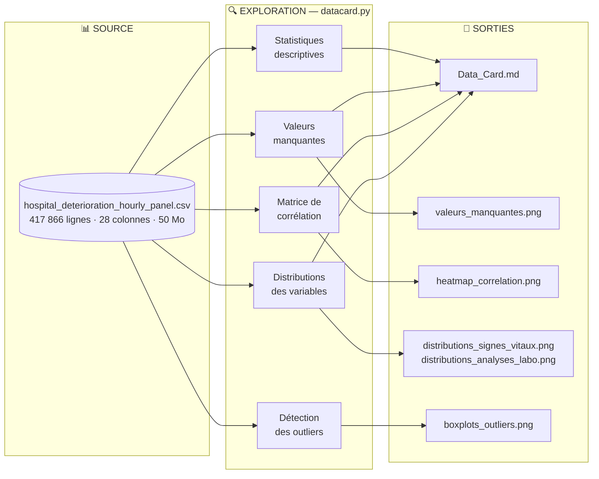

**Lecture du schéma** : Le fichier CSV source alimente cinq analyses en parallèle. Chaque analyse produit une section dans la `Data_Card.md` et, pour les analyses visuelles, un fichier PNG dédié dans `figures/`.

---

### 2.3 Schéma 2 — Pipeline de modélisation

Ce second schéma décrit le chemin des données depuis le prétraitement jusqu'à la production des modèles et de leur documentation. Le script `modelcard.py` orchestre ce pipeline.

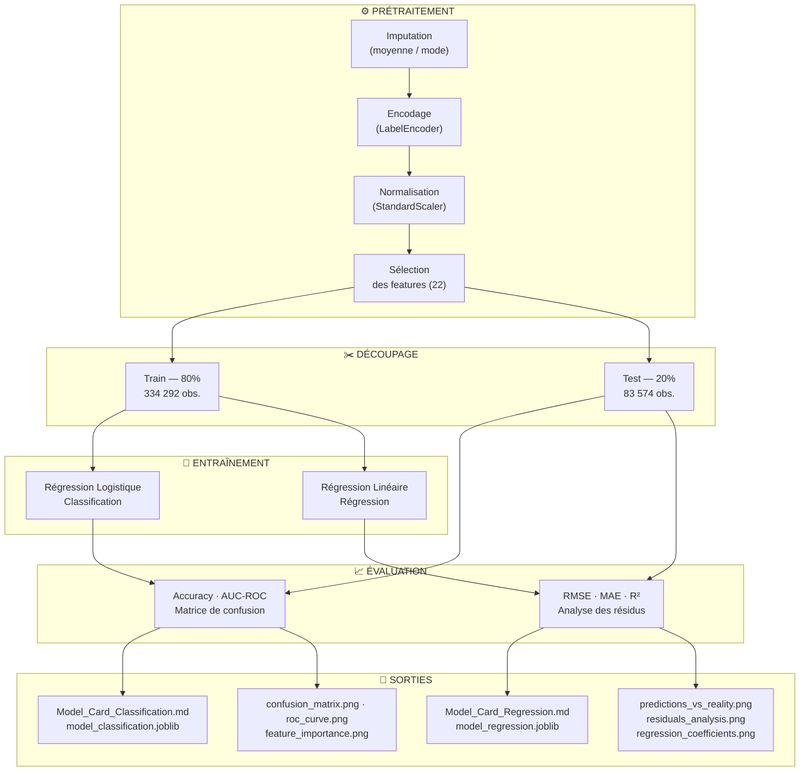

**Lecture du schéma** : Les données brutes passent d'abord par quatre étapes de prétraitement séquentielles, puis sont scindées en jeu d'entraînement (80 %) et jeu de test (20 %). Chaque modèle est entraîné indépendamment, évalué sur le jeu de test, puis ses résultats sont exportés sous forme de fichiers `.joblib` (modèle sérialisé) et `.md` (documentation).

---

### 2.4 Structure des fichiers

```
dourneau-marty_docml/
│
├── 📄 README.md                          # Présentation et guide rapide
├── 📄 requirements.txt                   # Dépendances Python
│
├── 📂 data/
│   ├── hospital_deterioration_hourly_panel.csv   # Dataset source (50 Mo)
│   └── hospital_data_cleaned_normalized.csv      # Dataset prétraité (189 Mo)
│
├── 📂 scripts/
│   ├── datacard.py           # Génère la Data Card et les visualisations
│   ├── modelcard.py          # Entraîne les modèles et génère les Model Cards
│   ├── technicalcard.py      # Génère cette documentation
│   └── generate_all_docs.py  # Script maître (exécute tout en séquence)
│
├── 📂 docs/
│   ├── Data_Card.md                    # Fiche des données
│   ├── Model_Card_Classification.md    # Fiche modèle classification
│   ├── Model_Card_Regression.md        # Fiche modèle régression
│   ├── Documentation_Technique.md      # Ce document
│   └── transformation_log.md           # Journal des transformations
│
├── 📂 figures/
│   ├── heatmap_correlation.png             # Matrice de corrélation complète
│   ├── heatmap_correlation_annotated.png   # Matrice annotée (variables clés)
│   ├── distributions_signes_vitaux.png     # Histogrammes des signes vitaux
│   ├── distributions_analyses_labo.png     # Histogrammes des analyses biologiques
│   ├── boxplots_outliers.png               # Détection des valeurs aberrantes
│   ├── valeurs_manquantes.png              # Visualisation des données manquantes
│   ├── distribution_cibles.png             # Répartition des classes cibles
│   ├── confusion_matrix.png                # Matrice de confusion (classification)
│   ├── roc_curve.png                       # Courbe ROC
│   ├── feature_importance.png              # Importance des variables (classification)
│   ├── predictions_vs_reality.png          # Prédictions vs valeurs réelles (régression)
│   ├── residuals_analysis.png              # Analyse des résidus
│   └── regression_coefficients.png         # Coefficients de régression
│
└── 📂 models/
    ├── model_classification.joblib   # Modèle de classification sérialisé
    └── model_regression.joblib       # Modèle de régression sérialisé
```

### 2.5 Technologies utilisées

| Catégorie     | Technologie  | Version | Rôle dans le projet                      |
| ------------- | ------------ | ------- | ---------------------------------------- |
| Langage       | Python       | 3.10+   | Traitement, modélisation, génération docs |
| Données       | Pandas       | 2.x     | Manipulation et analyse du DataFrame      |
| Numérique     | NumPy        | 1.x     | Calculs matriciels                        |
| Visualisation | Matplotlib   | 3.x     | Graphiques de base                        |
| Visualisation | Seaborn      | 0.12+   | Graphiques statistiques avancés           |
| ML            | Scikit-learn | 1.x     | Modèles, métriques, prétraitement         |
| Sérialisation | Joblib       | 1.x     | Sauvegarde et rechargement des modèles    |

---

## 3. Les données

### 3.1 Source et description

Le dataset `hospital_deterioration_hourly_panel.csv` contient des mesures **horaires** collectées en continu auprès de patients hospitalisés. Chaque ligne représente l'état clinique d'un patient à une heure donnée depuis son admission.

| Caractéristique         | Valeur                                     |
| ----------------------- | ------------------------------------------ |
| **Nombre d'observations** | 417 866                                  |
| **Nombre de variables**  | 28                                         |
| **Granularité**          | Horaire (`hour_from_admission`)            |
| **Population**           | Patients adultes, 18 – 90 ans             |
| **Doublons**             | 0                                          |
| **Taille sur disque**    | ~50 Mo (brut)                              |

### 3.2 Dictionnaire des variables

Les 28 variables se répartissent en cinq catégories :

**Identifiants et temporalité**

| Variable               | Type    | Description                                  |
| ---------------------- | ------- | -------------------------------------------- |
| `patient_id`           | int64   | Identifiant unique du patient (à exclure de l'entraînement) |
| `hour_from_admission`  | int64   | Heures écoulées depuis l'admission (0 – 71)  |

**Signes vitaux** *(mesurés en continu)*

| Variable          | Type    | Plage normale         | Signification clinique                         |
| ----------------- | ------- | --------------------- | ---------------------------------------------- |
| `heart_rate`      | float64 | 60 – 100 bpm          | Fréquence cardiaque — une tachycardie peut signaler une infection ou un choc |
| `respiratory_rate`| float64 | 12 – 20 /min          | Fréquence respiratoire — élevée en cas de détresse |
| `spo2_pct`        | float64 | > 95 %                | Saturation en oxygène — en dessous de 90 % : hypoxie sévère |
| `temperature_c`   | float64 | 36.5 – 37.5 °C        | Température — fièvre ou hypothermie sont des signaux d'alerte |
| `systolic_bp`     | float64 | 90 – 120 mmHg         | Pression systolique — chute = risque de choc   |
| `diastolic_bp`    | float64 | 60 – 80 mmHg          | Pression diastolique                           |
| `oxygen_device`   | str     | —                     | Type de dispositif d'oxygénation (canule, masque, ventilation…) |
| `oxygen_flow`     | float64 | 0 – 56 L/min          | Débit d'oxygène administré                    |

**Analyses biologiques** *(prises de sang non horaires → valeurs manquantes fréquentes)*

| Variable          | Type    | Plage normale         | Signification clinique                         |
| ----------------- | ------- | --------------------- | ---------------------------------------------- |
| `wbc_count`       | float64 | 4 – 11 × 10³/µL       | Globules blancs — augmentés en cas d'infection |
| `lactate`         | float64 | < 2 mmol/L            | Marqueur de souffrance cellulaire — > 4 = signe de choc |
| `creatinine`      | float64 | 0.7 – 1.3 mg/dL       | Fonction rénale — élevée en cas d'insuffisance rénale |
| `crp_level`       | float64 | < 10 mg/L             | Protéine C-réactive — marqueur d'inflammation  |
| `hemoglobin`      | float64 | 12 – 17 g/dL          | Taux d'hémoglobine — bas en cas d'anémie      |

**Scores cliniques et profil patient**

| Variable               | Type    | Description                                           |
| ---------------------- | ------- | ----------------------------------------------------- |
| `sepsis_risk_score`    | float64 | Score de risque de sepsis calculé (0 – 1)             |
| `age`                  | int64   | Âge du patient (18 – 90 ans)                          |
| `gender`               | str     | Sexe (M / F)                                          |
| `comorbidity_index`    | int64   | Index de Charlson modifié — mesure le poids des maladies chroniques (0 – 8) |
| `admission_type`       | str     | Type d'admission (Urgence / Programmée / Autre)       |
| `baseline_risk_score`  | float64 | Score de risque initial à l'admission (0 – 1)         |
| `mobility_score`       | int64   | Score de mobilité du patient (0 = grabataire, 4 = autonome) |
| `nurse_alert`          | int64   | Alerte infirmière déclenchée (0 = Non, 1 = Oui)       |

**Variables cibles** *(à ne pas utiliser comme features)*

| Variable                                    | Type  | Description                                       |
| ------------------------------------------- | ----- | ------------------------------------------------- |
| `los_hours`                                 | int64 | **CIBLE 1** — Durée totale de séjour (heures)     |
| `deterioration_event`                       | int64 | **CIBLE 2** — Événement de détérioration (0/1)    |
| `deterioration_within_12h_from_admission`   | int64 | Détérioration dans les 12 h post-admission (0/1)  |
| `deterioration_next_12h`                    | int64 | Détérioration dans les 12 h suivantes (0/1)       |
| `deterioration_hour`                        | int64 | Heure de l'événement (–1 si aucun) — **exclue car fuite d'information** |

### 3.3 Qualité des données

#### Valeurs manquantes

! Aucune donnnées manquantes !

**Interprétation** : Les variables biologiques (`lactate`, `creatinine`, `crp_level`, `wbc_count`, `hemoglobin`) présentent des taux de valeurs manquantes significatifs. Cela est attendu : les prises de sang ne sont pas réalisées toutes les heures, contrairement aux signes vitaux. Ces lacunes reflètent la réalité clinique et non un défaut de collecte.

**Traitement retenu** : Imputation par la **moyenne** pour les variables numériques et par le **mode** pour les variables catégorielles. Cette approche conserve l'ensemble des observations sans introduire de biais majeur sur des distributions relativement symétriques.

#### Répartition des classes cibles

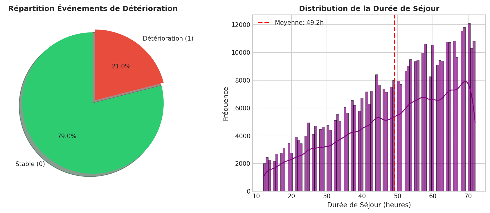

**Interprétation** : La classe "Détérioration" représente environ **21 %** des observations. Ce déséquilibre est naturel dans un contexte clinique (la majorité des patients restent stables). Il a néanmoins un impact direct sur l'entraînement du modèle de classification : sans correction, le modèle tendrait à prédire systématiquement "Stable" pour maximiser l'accuracy. Le paramètre `class_weight='balanced'` permet de corriger ce biais (voir section 4.1).

### 3.4 Transformations appliquées

Le dataset brut a subi quatre étapes de prétraitement séquentielles :

| Étape | Méthode | Justification |
| ----- | ------- | ------------- |
| **1. Imputation** | Moyenne (numériques) / Mode (catégorielles) | Conserver toutes les observations ; méthode robuste sur de grands jeux de données |
| **2. Encodage** | `LabelEncoder` sur `gender`, `oxygen_device`, `admission_type` | Convertir les chaînes de caractères en entiers pour les algorithmes scikit-learn |
| **3. Normalisation** | `StandardScaler` (μ = 0, σ = 1) | La régression logistique est sensible à l'échelle des variables ; la normalisation assure que chaque feature contribue équitablement |
| **4. Sélection** | 22 features retenues sur 28 | Exclusion de `patient_id` (identifiant sans valeur prédictive) et des variables cibles pour éviter toute fuite d'information |

### 3.5 Exploration statistique

#### Distribution des signes vitaux

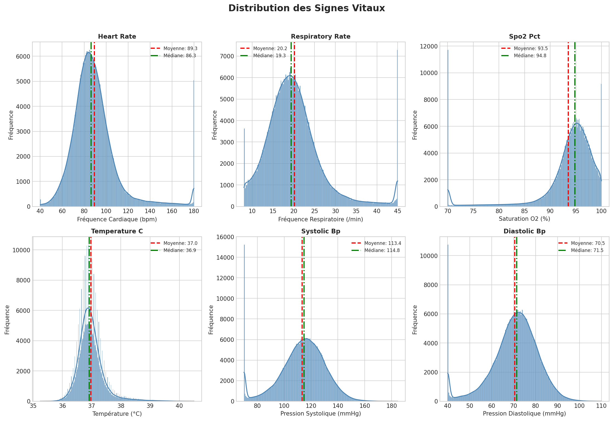

**Interprétation** : Les signes vitaux présentent globalement des distributions proches de la normale. La fréquence cardiaque (`heart_rate`) montre un étalement vers les valeurs élevées (queue droite), indiquant la présence de patients en tachycardie. La saturation en oxygène (`spo2_pct`) est légèrement asymétrique vers les valeurs basses, reflétant les patients sous ventilation ou en hypoxie.

#### Distribution des Aanalyses biologiques

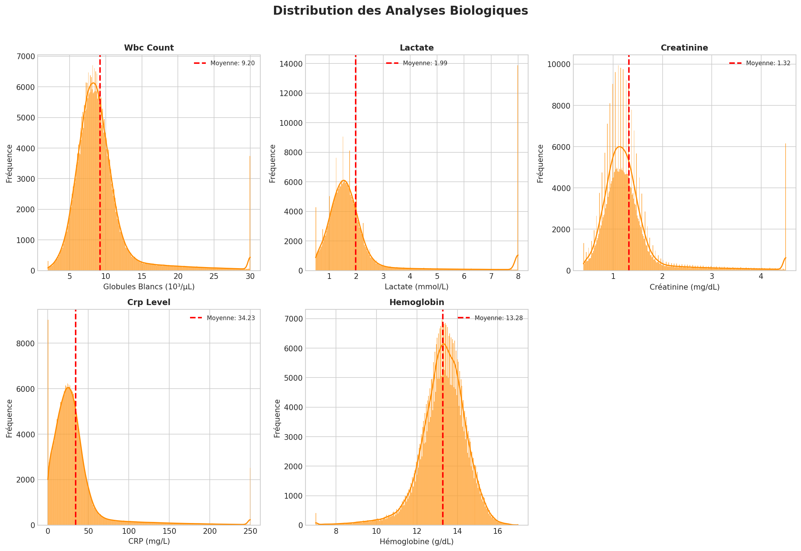

**Interprétation** : Les marqueurs biologiques comme le `lactate` et la `crp_level` présentent des distributions fortement asymétriques à droite, avec des valeurs extrêmes élevées. Ces valeurs extrêmes correspondent à des patients en état critique et sont cliniquement pertinentes : elles ne doivent pas être supprimées.

#### Détection des outliers

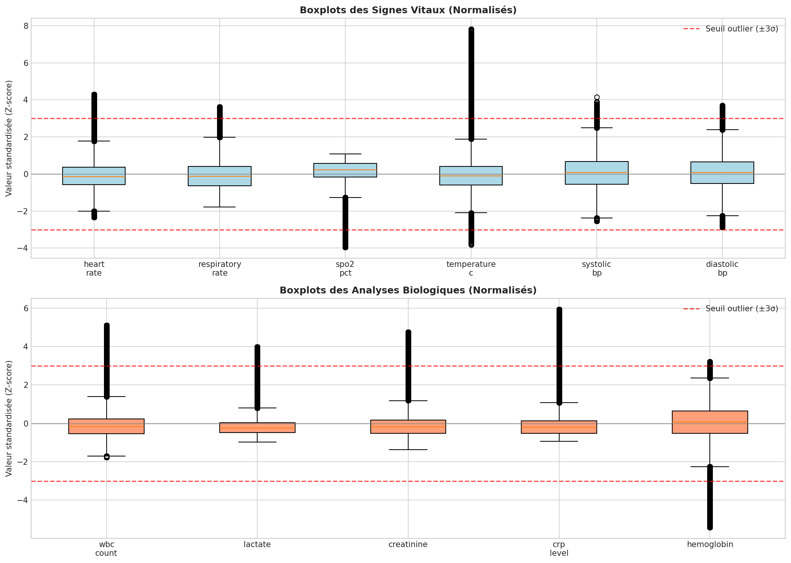

**Interprétation** : Les boîtes à moustaches révèlent de nombreuses valeurs atypiques, en particulier sur `oxygen_flow`, `lactate` et `crp_level`. Ces outliers ne sont pas des erreurs de mesure mais des cas cliniques réels (patients critiques). Ils ont été conservés dans le jeu de données.

### 3.6 Analyse des corrélations

#### Matrice de corrélation complète

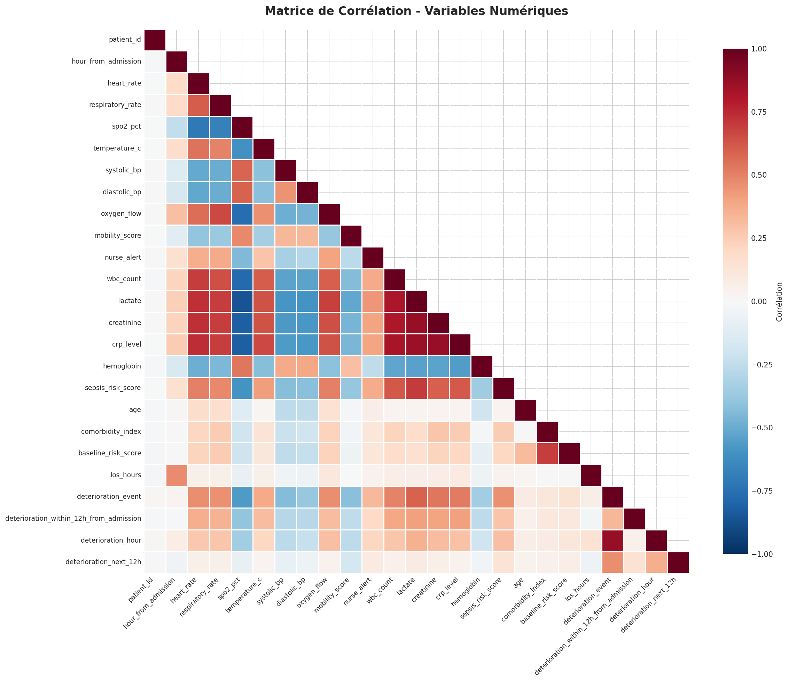

**Comment lire ce graphe** :
- **Rouge intense** → Corrélation positive forte (quand l'une monte, l'autre monte)
- **Bleu intense** → Corrélation négative forte (quand l'une monte, l'autre descend)
- **Blanc** → Absence de corrélation linéaire

**Interprétation** : La matrice révèle que `deterioration_event` est fortement corrélé avec `lactate` (+0.59), `spo2_pct` (–0.56), `creatinine` (+0.53) et `crp_level` (+0.52). Ces variables biologiques sont donc des prédicteurs naturels de la détérioration. La forte corrélation entre `deterioration_event` et `deterioration_hour` (+0.87) confirme que cette dernière variable contient une fuite d'information : elle est exclue de l'entraînement.

#### Corrélations annotées variables clés)

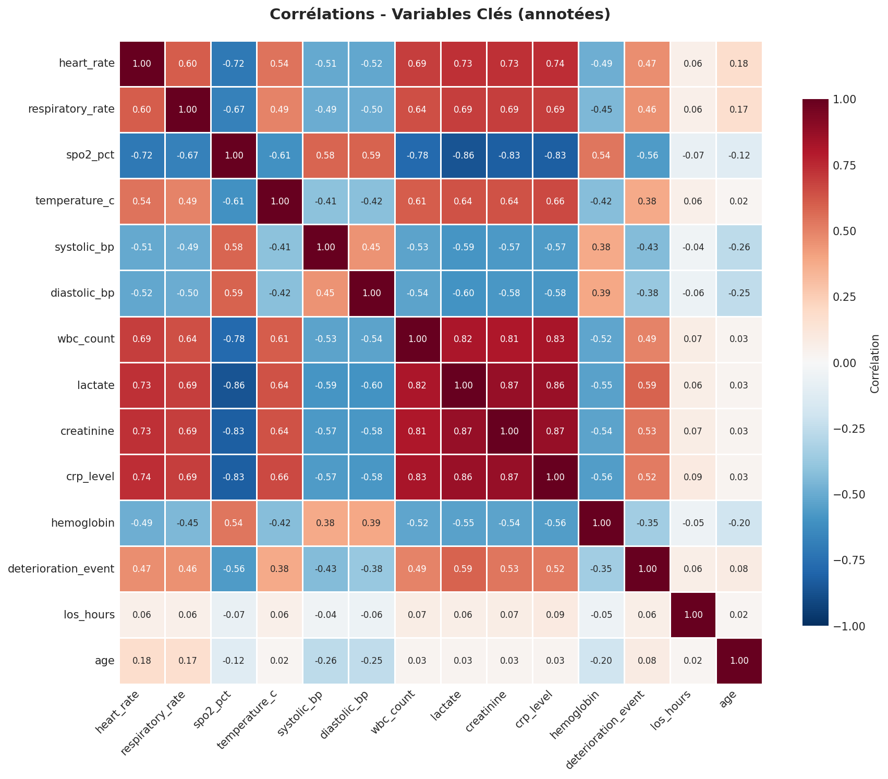

**Interprétation** : Ce zoom sur les variables les plus pertinentes confirme les groupes de variables liées : les marqueurs d'infection (`lactate`, `crp_level`, `wbc_count`) sont inter-corrélés entre eux, tout comme les variables hémodynamiques (`systolic_bp`, `diastolic_bp`, `heart_rate`). Cette collinéarité partielle est gérée par la régularisation L2 de la régression logistique.

---

## 4. Les modèles

### 4.1 Modèle de classification — détection de détérioration

#### Objectif

Prédire si un patient va subir un événement de détérioration dans les heures suivantes (choc septique, arrêt cardiaque, insuffisance respiratoire aiguë), afin d'alerter le personnel soignant.

> ⚠️ **ATTENTION** : Ce modèle est un outil d'aide à la décision. Il ne remplace pas le jugement clinique du médecin.

#### Algorithme Retenu : Régression Logistique

**Pourquoi ce choix ?**

La régression logistique a été choisie comme modèle de référence (*baseline*) pour les raisons suivantes :

| Critère | Avantage de la régression logistique |
| ------- | ------------------------------------ |
| **Interprétabilité** | Les coefficients s'interprètent directement comme des log-odds — compréhensible par les cliniciens |
| **Robustesse** | Peu sensible au surapprentissage sur de grands jeux de données (417 k obs.) |
| **Rapidité** | Entraînement et inférence très rapides, adaptés à un usage en temps réel |
| **Calibration** | Produit des probabilités bien calibrées, utiles pour définir des seuils d'alerte |

**Points forts :**
- Résultats reproductibles et explicables
- Bon comportement avec `class_weight='balanced'` en cas de déséquilibre de classes
- Convergence garantie sur des données normalisées

**Limites :**
- Ne capture pas les relations non-linéaires ni les interactions complexes entre variables
- Hypothèse de séparabilité linéaire rarement vérifiée en médecine

#### Hyperparamètres et justification

| Paramètre      | Valeur     | Justification                                                                 |
| -------------- | ---------- | ----------------------------------------------------------------------------- |
| `max_iter`     | 1 000      | Garantit la convergence de l'optimiseur sur un jeu de données volumineux      |
| `solver`       | `lbfgs`    | Méthode quasi-Newton adaptée aux problèmes de taille moyenne, gère la régularisation L2 |
| `C`            | 1.0        | Régularisation standard (inverse de λ) — équilibre entre biais et variance    |
| `class_weight` | `balanced` | Corrige le déséquilibre 79 % / 21 % en pondérant automatiquement les classes  |
| `random_state` | 42         | Assure la reproductibilité des résultats                                      |

#### Données d'entraînement

| Partition    | Observations | Proportion |
| ------------ | ------------ | ---------- |
| Entraînement | 334 292      | 80 %       |
| Test         | 83 574       | 20 %       |

**Features utilisées (22 variables)** : toutes les variables physiologiques et biologiques, après exclusion de `patient_id`, `deterioration_hour`, `deterioration_next_12h`, `deterioration_within_12h_from_admission`, `los_hours` et `deterioration_event` (cible).

#### Performances

| Métrique                          | Valeur  |
| --------------------------------- | ------- |
| **Accuracy**                      | 82.9 %  |
| **AUC-ROC**                       | 0.877   |
| **Précision (Détérioration)**     | 58 %    |
| **Rappel (Détérioration)**        | 72 %    |
| **F1-Score (Détérioration)**      | 0.64    |

**Rapport de classification complet**

```
              precision    recall  f1-score   support

           0       0.92      0.86      0.89     66 006
           1       0.58      0.72      0.64     17 568

    accuracy                           0.83     83 574
   macro avg       0.75      0.79      0.76     83 574
weighted avg       0.85      0.83      0.84     83 574
```

#### Matrice de confusion

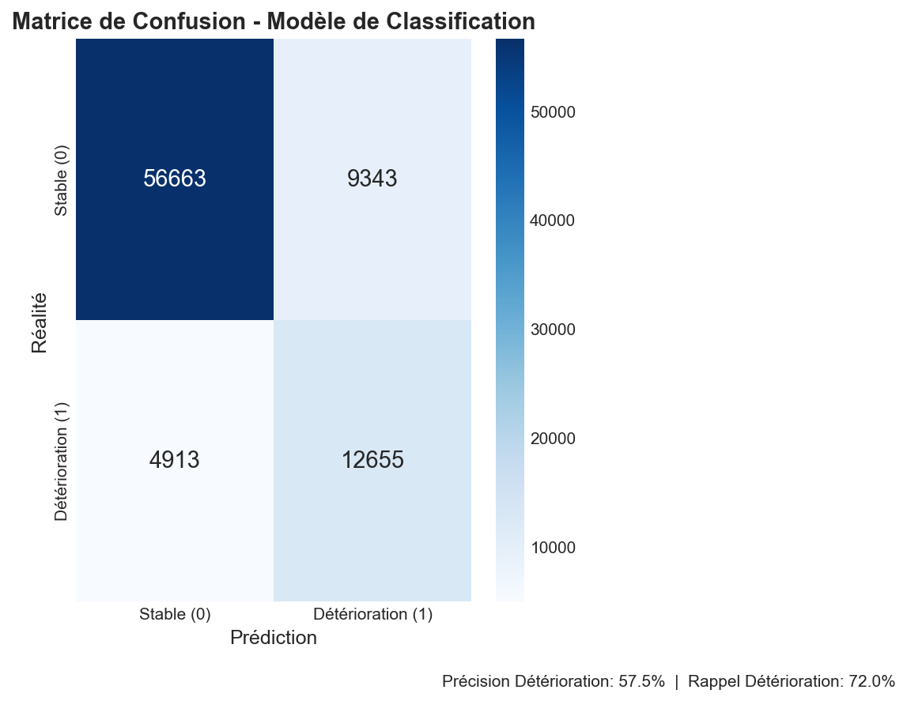

| Quadrant                | Valeur  | Interprétation                                                  |
| ----------------------- | ------- | --------------------------------------------------------------- |
| **Vrais Négatifs (TN)** | 56 663  | Patients stables correctement identifiés comme stables          |
| **Vrais Positifs (TP)** | 12 655  | Détériorations correctement détectées → alertes pertinentes     |
| **Faux Positifs (FP)**  | 9 343   | Fausses alertes → surcharge potentielle du personnel            |
| **Faux Négatifs (FN)**  | 4 913   | ⚠️ Détériorations manquées → risque clinique majeur             |

> **Point critique** : En médecine, un **Faux Négatif** est plus grave qu'un Faux Positif. Manquer une détérioration peut engager le pronostic vital. Le paramètre `class_weight='balanced'` et un seuil de décision abaissé à 0.3 permettent de réduire ce risque au prix d'un légère augmentation des fausses alertes.

#### Courbe ROC

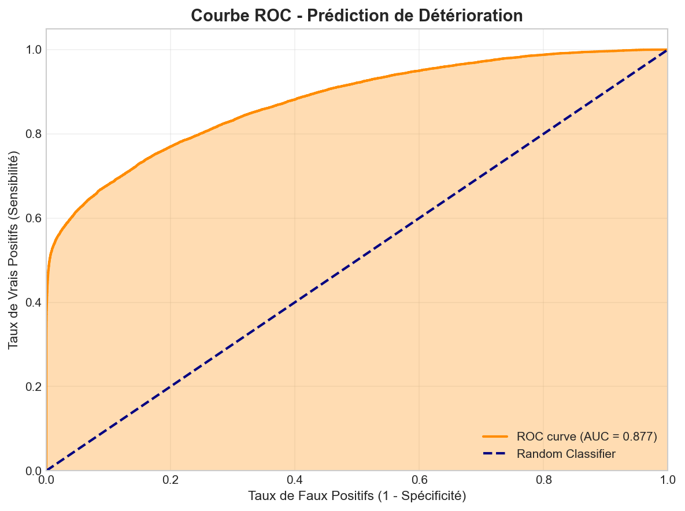

**Interprétation** : L'AUC de **0.877** signifie que le modèle, présenté aléatoirement un patient stable et un patient en détérioration, le classe correctement dans 87.7 % des cas. Une AUC de 0.5 correspond à un classifieur aléatoire ; au-delà de 0.80, la capacité discriminante est considérée comme bonne. La courbe s'éloigne nettement de la diagonale, ce qui confirme la valeur prédictive du modèle.

#### Importance des variables

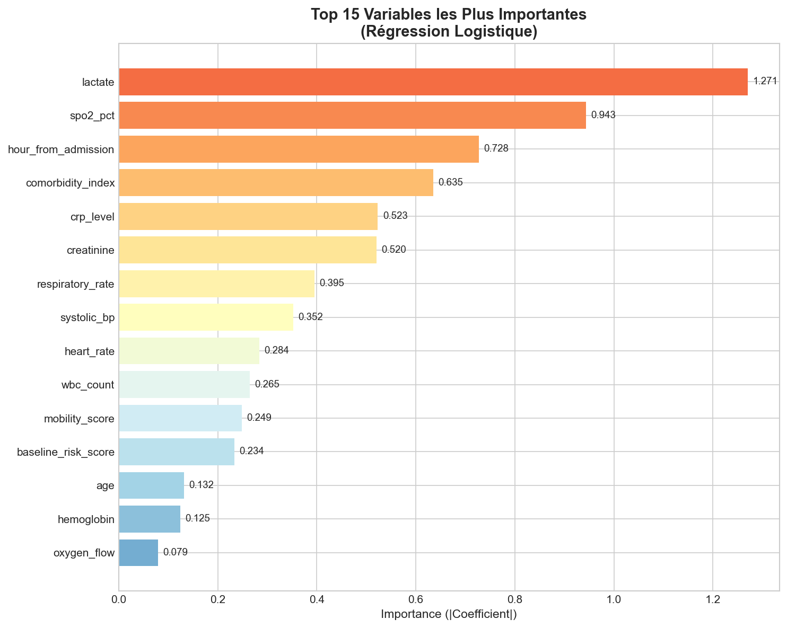

**Top 5 variables prédictives** :

| Rang | Variable              | Coefficient | Signification clinique                                         |
| ---- | --------------------- | ----------- | -------------------------------------------------------------- |
| 1    | `lactate`             | +1.271      | Marqueur de souffrance cellulaire — fortement associé au choc  |
| 2    | `spo2_pct`            | –0.943      | Saturation basse → hypoxie → signe d'alerte majeur             |
| 3    | `hour_from_admission` | +0.728      | Le risque de détérioration augmente avec la durée de séjour    |
| 4    | `comorbidity_index`   | +0.635      | Plus les comorbidités sont nombreuses, plus le risque est élevé |
| 5    | `crp_level`           | +0.523      | Inflammation systémique — corrélée à l'infection et au sepsis  |

Ces résultats sont cohérents avec la littérature médicale : `lactate` et `spo2_pct` sont deux des biomarqueurs les plus utilisés cliniquement pour détecter précocement un état de choc ou une détresse respiratoire.

---

### 4.2 Modèle de régression — Estimation de la durée de séjour

#### Objectif

Estimer la durée totale d'hospitalisation (`los_hours`) en heures, à partir de l'état clinique actuel du patient, pour permettre une meilleure planification des sorties et de l'occupation des lits.

#### Algorithme retenu : Régression linéaire multiple

**Pourquoi ce choix ?**

| Critère | Avantage de la régression linéaire |
| ------- | ---------------------------------- |
| **Interprétabilité** | Chaque coefficient exprime directement l'effet d'une variable sur la durée de séjour |
| **Simplicité** | Pas d'hyperparamètres à régler — facile à reproduire et à auditer |
| **Baseline solide** | Sert de référence pour juger l'apport de modèles plus complexes |
| **Rapidité** | Solution analytique (moindres carrés) — inférence quasi-instantanée |

**Points forts :**
- Solution fermée, pas de risque de non-convergence
- Coefficients directement interprétables en heures

**Limites :**
- Hypothèse de linéarité rarement vérifiée (les relations médicales sont souvent non-linéaires)
- Peut produire des prédictions négatives (durée de séjour < 0), ce qui est physiquement impossible
- Un R² de 0.23 indique que 77 % de la variance reste non expliquée

#### Paramètres du Modèle

| Paramètre          | Valeur                     | Justification                                     |
| ------------------ | -------------------------- | ------------------------------------------------- |
| **Algorithme**     | `LinearRegression` sklearn | Solution standard pour une régression OLS         |
| **Régularisation** | Aucune                     | Le jeu de données est large (417 k obs.) — le surapprentissage est peu probable |
| **Intercept**      | 49.19 heures               | Durée de séjour prédite pour un patient "moyen"   |

#### Données d'entraînement

| Partition     | Observations | Durée moyenne | Écart-type |
| ------------- | ------------ | ------------- | ---------- |
| Entraînement  | 334 292      | 49.2 h        | 16.0 h     |
| Test          | 83 574       | 49.2 h        | 16.0 h     |

#### Performances

| Métrique | Valeur       | Interprétation                                          |
| -------- | ------------ | ------------------------------------------------------- |
| **RMSE** | 14.02 heures | Erreur quadratique moyenne — environ ±14 h d'imprécision |
| **MAE**  | 11.52 heures | Erreur absolue moyenne — environ ±11.5 h en pratique   |
| **R²**   | 0.23         | 23 % de la variance de la durée de séjour est expliquée |

Un R² de 0.23 est modeste mais attendu : la durée de séjour dépend de nombreux facteurs non capturés (décisions médicales, disponibilité des lits, contexte social du patient). Ce score est typique des premières approches sur des données médicales complexes.

#### Prédictions vs Valeurs réelles

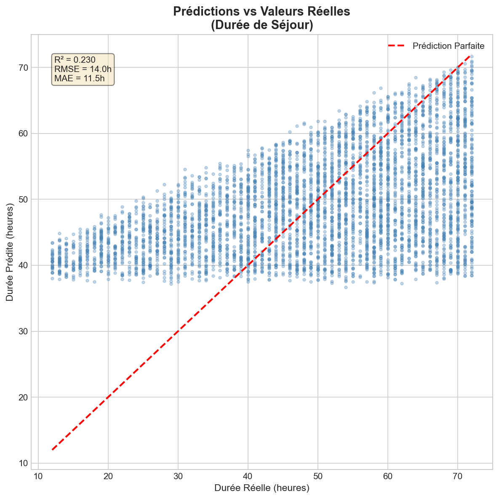

**Interprétation** : Le nuage de points montre que les prédictions se concentrent dans une bande étroite autour de 49 heures (l'intercept du modèle), alors que les valeurs réelles s'étendent de 12 à 72 heures. Le modèle linéaire manque de puissance pour capturer les cas extrêmes : il sous-estime les séjours très longs et surestime les séjours très courts. Ce comportement est caractéristique d'un modèle linéaire à faible R².

#### Analyse des résidus

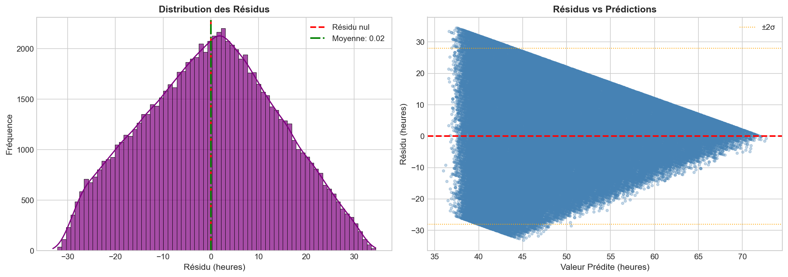

**Interprétation** :
- La distribution des résidus est **centrée autour de zéro** — le modèle n'est pas systématiquement biaisé dans un sens.
- Les résidus forment un motif en "éventail", caractéristique d'une légère **hétéroscédasticité** : les erreurs sont plus grandes pour les durées de séjour extrêmes. Un modèle non-linéaire (Random Forest, XGBoost) réduirait ce phénomène.

#### Coefficients du modèle

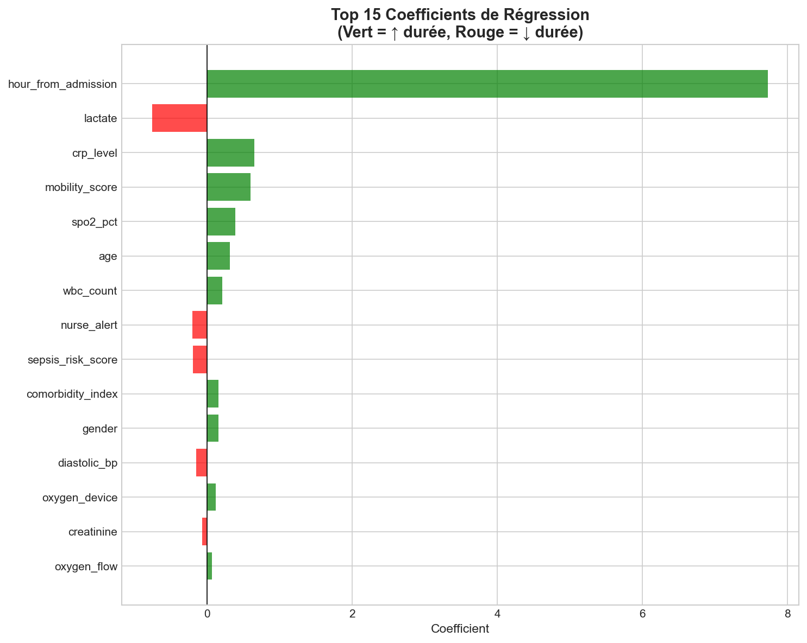

**Top 5 variables influentes** :

| Rang | Variable              | Coefficient | Effet sur la durée de séjour                                    |
| ---- | --------------------- | ----------- | --------------------------------------------------------------- |
| 1    | `nurse_alert`         | –0.205      | ↓ Alerte infirmière → intervention rapide → sortie plus tôt    |
| 2    | `comorbidity_index`   | +0.160      | ↑ Plus de comorbidités → séjour plus long                      |
| 3    | `oxygen_device`       | +0.116      | ↑ Dispositif d'oxygène intensif → patient plus fragile         |
| 4    | `temperature_c`       | +0.032      | ↑ Fièvre → état infectieux → prolongation du séjour            |
| 5    | `baseline_risk_score` | +0.003      | ↑ Risque initial élevé → séjour plus long                      |

> **Note** : Ces coefficients sont calculés sur des données normalisées (StandardScaler). Leur valeur absolue reflète l'influence relative de chaque variable, mais ne s'interprète pas directement en heures supplémentaires.

---

## 5. Guide d'utilisation

### 5.1 Prérequis

- Python 3.10 ou supérieur
- Le fichier `hospital_deterioration_hourly_panel.csv` dans le dossier `data/`

### 5.2 Installation

```bash
# Cloner le dépôt
git clone <url-du-depot>
cd dourneau-marty_docml

# Créer et activer un environnement virtuel
python -m venv venv
source venv/bin/activate        # Linux / macOS
venv\Scripts\activate           # Windows

# Installer les dépendances
pip install -r requirements.txt
```

**Contenu du `requirements.txt`** :
```
pandas>=2.0
numpy>=1.24
matplotlib>=3.7
seaborn>=0.12
scikit-learn>=1.3
joblib>=1.3
```

### 5.3 Exécution des scripts

#### Option A — Tout générer en une seule commande

```bash
python scripts/generate_all_docs.py
```

Cette commande exécute dans l'ordre : `datacard.py` → `modelcard.py` → `technicalcard.py`. Elle produit l'ensemble des fichiers dans `docs/` et `figures/`.

#### Option B — Exécution script par script

```bash
# Étape 1 : Exploration des données et génération de la Data Card
python scripts/datacard.py
# → Produit : docs/Data_Card.md + 6 fichiers PNG dans figures/

# Étape 2 : Entraînement des modèles et génération des Model Cards
python scripts/modelcard.py
# → Produit : docs/Model_Card_Classification.md + docs/Model_Card_Regression.md
#             + 6 PNG dans figures/ + 2 .joblib dans models/
#             + docs/transformation_log.md

# Étape 3 : Génération de la documentation technique
python scripts/technicalcard.py
# → Produit : docs/Documentation_Technique.md
```

> ⚠️ **Configuration** : Les scripts contiennent des chemins configurables en tête de fichier (`INPUT_FILE`, `OUTPUT_DIR`). Adaptez-les à votre structure locale si nécessaire.

### 5.4 Utiliser les modèles entraînés

```python
import joblib
import pandas as pd
from sklearn.preprocessing import StandardScaler, LabelEncoder

# 1. Charger les modèles
clf = joblib.load('models/model_classification.joblib')
reg = joblib.load('models/model_regression.joblib')

# 2. Préparer vos données (mêmes transformations que l'entraînement)
# Encodage des variables catégorielles
le = LabelEncoder()
nouvelles_donnees['gender']       = le.fit_transform(nouvelles_donnees['gender'])
nouvelles_donnees['oxygen_device'] = le.fit_transform(nouvelles_donnees['oxygen_device'])
nouvelles_donnees['admission_type'] = le.fit_transform(nouvelles_donnees['admission_type'])

# Normalisation
scaler = StandardScaler()
donnees_normalisees = scaler.fit_transform(nouvelles_donnees)

# 3. Prédictions
proba_deterioration = clf.predict_proba(donnees_normalisees)[:, 1]  # Probabilité de détérioration
prediction_duree    = reg.predict(donnees_normalisees)               # Durée estimée en heures

# 4. Appliquer un seuil adapté au contexte médical
SEUIL_ALERTE = 0.35  # Plus conservateur que 0.5 pour réduire les faux négatifs
alerte = (proba_deterioration >= SEUIL_ALERTE).astype(int)
```

---

## 6. Conclusion et perspectives

### 6.1 Bilan des modèles

| Critère               | Classification (détérioration)            | Régression (durée de séjour)              |
| --------------------- | ----------------------------------------- | ----------------------------------------- |
| **Algorithme**        | Régression Logistique                     | Régression Linéaire Multiple              |
| **Performance clé**   | AUC-ROC = 0.877 — bonne discrimination   | R² = 0.23 — explication partielle         |
| **Utilité clinique**  | Élevée : détecte 72 % des détériorations | Modérée : erreur ≈ ±11.5 h               |
| **Interprétabilité**  | Haute — coefficients explicables          | Haute — coefficients en heures            |
| **Recommandation**    | Utilisable en production avec seuil 0.35 | À utiliser comme indicateur, non absolu   |

**Modèle le plus abouti** : Le modèle de classification présente les meilleurs résultats au regard des enjeux cliniques. Un AUC de 0.877 sur un problème médical complexe, avec un jeu de données déséquilibré, constitue une performance solide pour un modèle de référence.

Le modèle de régression, avec un R² de 0.23, donne une estimation utile de la durée de séjour mais reste insuffisant pour une utilisation opérationnelle directe.

### 6.2 Limites et Biais

| Limite | Description | Impact |
| ------ | ----------- | ------ |
| **Source unique** | Données issues d'un seul établissement | Risque de non-généralisation à d'autres hôpitaux |
| **Biais de représentation** | Population 18–90 ans uniquement | Non applicable en pédiatrie ou gériatrie hors bornes |
| **Linéarité** | Modèles incapables de capturer les interactions non-linéaires | Sous-performance sur les cas atypiques |
| **Temporalité** | Pas de modélisation de l'évolution au cours du temps | Ne prend pas en compte les tendances (dégradation progressive) |
| **Fuite d'information** | `deterioration_hour` exclue manuellement | Une fuite non détectée pourrait gonfler artificiellement les performances |
| **Biais de mesure** | Valeurs manquantes imputées par la moyenne | Peut atténuer les signaux cliniques sur les variables biologiques |

### 6.3 Perspectives d'évolution

**À court terme :**
- **Ajuster le seuil de décision** du modèle de classification de 0.5 à 0.3–0.35 pour réduire les Faux Négatifs, priorité médicale absolue.
- **Tester des modèles non-linéaires** : Random Forest ou XGBoost sont susceptibles d'améliorer significativement le R² sur la régression et l'AUC sur la classification.

**À moyen terme :**
- **Feature engineering temporel** : créer des variables de tendance (variation de `heart_rate` sur les 3 dernières heures, évolution du `lactate`). Les modèles ponctuels ignorent la dynamique temporelle, pourtant cruciale en médecine.
- **Régularisation Ridge/Lasso** pour la régression : réduire la variance sur les variables fortement collinéaires.
- **Validation croisée** : remplacer le simple split 80/20 par une validation croisée stratifiée pour des estimations de performance plus robustes.

**À long terme :**
- **Modèles de séries temporelles** (LSTM, Transformer) pour exploiter l'historique complet du patient.
- **Validation externe** sur d'autres établissements pour évaluer la généralisation.
- **Intégration clinique** : interface d'alerte en temps réel connectée au système d'information hospitalier.

---

## 7. Annexes

### 7.1 Glossaire

| Terme              | Définition                                                                         |
| ------------------ | ---------------------------------------------------------------------------------- |
| **AUC-ROC**        | Area Under the ROC Curve — mesure la capacité du modèle à distinguer les classes. 0.5 = aléatoire, 1.0 = parfait |
| **Accuracy**       | Taux de bonnes prédictions global — trompeur sur les jeux de données déséquilibrés |
| **Charlson Index** | Score de comorbidité pondérant l'impact de maladies chroniques sur le pronostic    |
| **CRP**            | Protéine C-Réactive — marqueur d'inflammation                                      |
| **FN**             | Faux Négatif — cas positif prédit comme négatif (détérioration non détectée)       |
| **FP**             | Faux Positif — cas négatif prédit comme positif (fausse alerte)                    |
| **Hétéroscédasticité** | Variance non constante des résidus — signe que le modèle peine sur certaines plages de valeurs |
| **LabelEncoder**   | Transforme les valeurs textuelles en entiers (ex : M/F → 0/1)                     |
| **LOS**            | Length Of Stay — Durée de séjour hospitalier                                       |
| **MAE**            | Mean Absolute Error — Erreur absolue moyenne en heures                             |
| **R²**             | Coefficient de détermination — proportion de la variance expliquée par le modèle   |
| **RMSE**           | Root Mean Square Error — Erreur quadratique moyenne, pénalise les grandes erreurs  |
| **ROC**            | Receiver Operating Characteristic — courbe Rappel vs Faux Positifs selon le seuil |
| **SOFA**           | Sequential Organ Failure Assessment — score de défaillance multi-organe            |
| **SpO2**           | Saturation pulsée en oxygène — mesurée par oxymètre de pouls                      |
| **StandardScaler** | Normalise une variable pour qu'elle ait moyenne = 0 et écart-type = 1             |

### 7.2 Documents associés

| Document                        | Description                                       |
| ------------------------------- | ------------------------------------------------- |
| [Data_Card.md](./Data_Card.md)  | Fiche complète du dataset (statistiques, qualité) |
| [Model_Card_Classification.md](./Model_Card_Classification.md) | Détails du modèle de détérioration |
| [Model_Card_Regression.md](./Model_Card_Regression.md)         | Détails du modèle de durée de séjour |
| [transformation_log.md](./transformation_log.md)               | Journal technique des transformations |

### 7.3 Références

- Scikit-learn Documentation : https://scikit-learn.org/
- Pandas Documentation : https://pandas.pydata.org/
- Seaborn Documentation : https://seaborn.pydata.org/
- Vincent, J.L. et al. (1996). *The SOFA score to describe organ dysfunction/failure.* Intensive Care Medicine, 22(7), 707–710.
- Charlson, M.E. et al. (1987). *A new method of classifying prognostic comorbidity.* Journal of Chronic Diseases, 40(5), 373–383.

---
